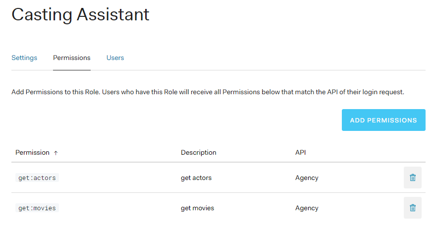
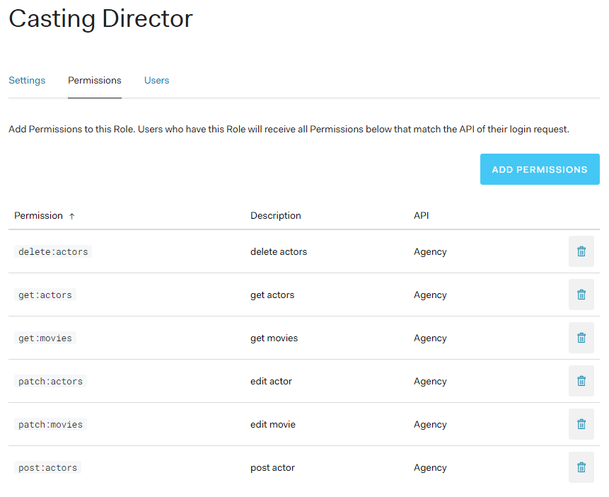
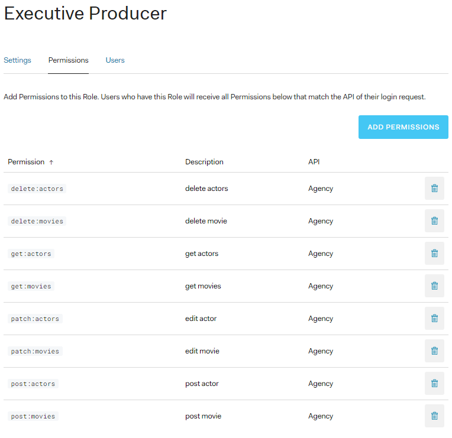

# Agency API

This is the capstone project of Udacitys' Full-Stack Developer Nano-degree.

The Casting Agency models a company that is responsible for creating movies 
and managing and assigning actors to those movies. You are an Executive Producer within the company and are creating a system to simplify and streamline your process.

## Start Project locally

```bash
cd <project-root-dir>
pg_ctl -D <postgress-path> start
createdb agency
pip install -r requirements.txt
python app.py
```

## API Documentation

### 1. GET /actors

Get page of actors
- Request Arguments: 
    - **integer** `page` (optional, 10 actors per page, defaults to `1`)
- Requires permission: `get:actors`
- Returns: 
  1. **list** `actors`:
      - **integer** `id`
      - **string** `name`
      - **string** `gender`
      - **integer** `age`
  2. **boolean** `success`
  3. **total_actors** `age`
- Example:
  - URL: http://{{host}}/actors?page=1
  - Response: [json](./docs/responses/get_actors_page.json)
- Errors:
  - 404 : invalid page number
  - 401 : un authorized

### 2. POST /actors

Post new actor.
- Body:
  - **string** `name`
  - **integer** `age`
  - **string** `gender`
- Requires permission: `post:actors`
- Returns: 
  1. **integer** `actor_id`
  2. **boolean** `success`
  
- Example:
  - URL: http://{{host}}/actors
    - Body: [json](./docs/requests/post_actor.json)
  - Response: [json](./docs/responses/post_actors.json)

- Errors:
  - 401 : un authorized "in valid token"
  - 422 : un processable "missing attribute"
  - 400 : invalid body

### 3. PATCH /actors/<actor_id>

Patch existing actor

- Body:
  - **string** `name` 
  - **integer** `age` 
  - **string** `gender`
- Requires permission: `patch:actors`
- Returns: 
  1. **integer** `actor_id`
  2. **boolean** `success`
  3. **list** `actors`:
      - **integer** `id`
      - **string** `name`
      - **string** `gender`
      - **integer** `age`

- Example:
  - URL: http://{{host}}/actors/4
    - Body: [json](./docs/requests/patch_actor.json)
  - Response: [json](./docs/responses/patch_actors.json)

- Errors:
  - 404 : actor id doesn't exists
  - 400 : invalid body or actor_id
  - 401 : un authorized "in valid token"


### 4. DELETE /actors/<actor_id>

Delete existing actor

- Requires permission: `delete:actors`
- Returns: 
  1. **integer** `actor_id`
  2. **boolean** `success`

- Example:
  - URL: http://{{host}}/actors/6
  - Response: [json](./docs/responses/delete_actors.json)

- Errors:
  - 404 : actor id doesn't exists
  - 400 : invalid actor_id
  - 401 : un authorized "in valid token"

### 5. GET /movies

Get movies page.

- Request Arguments: 
    - **integer** `page` (optional, 10 movies per page, defaults to `1`)
- Requires permission: `get:movies`
- Returns: 
  1. **list** `movies`:
      - **integer** `id`
      - **string** `name`
      - **date** `release_date`
  2. **boolean** `success`
  3. **integer** `total_movies`
- Example:
  - URL: http://{{host}}/movies?page=1
  - Response: [json](./docs/responses/get_movies_page.json)
- Errors:
  - 404 : invalid page number
  - 401 : un authorized

### 6. POST /movies

Post new movie.

- Body:
  - **string** `title`
  - **date** `release_date`
- Requires permission: `post:movies`
- Returns: 
  1. **integer** `movie_id`
  2. **boolean** `success`
- Example:
  - URL: http://{{host}}/movies
    - Body: [json](./docs/requests/post_movie.json)
  - Response: [json](./docs/responses/post_movies.json)
- Errors:
  - 401 : un authorized "in valid token"
  - 422 : un processable "missing attribute"
  - 400 : invalid body
  
### 7. PATCH /movies/<movie_id>

Patch existing movie.

- Request Arguments: **integer** `movie_id`
- Body
  - **string** `title` 
  - **date** `release_date` 
- Requires permission: `patch:movies`
- Returns: 
  1. **integer** `movie_id`
  2. **boolean** `success`
  3. **list** `movies`:
        - **integer** `id`
        - **string** `title` 
        - **date** `release_date` 
- Example:
  - URL: http://{{host}}/movies/10
    - Body: [json](./docs/requests/patch_movie.json)
  - Response: [json](./docs/responses/post_movies.json)

- Errors:
  - 404 : actor id doesn't exists
  - 400 : invalid body or movie_id
  - 401 : un authorized "in valid token"

### 8. DELETE /movies/<movie_id>

Delete existing movie.

- Request Arguments: **integer** `movie_id`
- Requires permission: `delete:movies`
- Returns: 
  1. **integer** `movie_id`
  2. **boolean** `success`

- Example:
  - URL: http://{{host}}/movies/20
  - Response: [json](./docs/responses/delete_movies.json)

- Errors:
  - 404 : actor id doesn't exists
  - 400 : invalid movie_id
  - 401 : un authorized "in valid token"

### Auth0 for locally use
#### Create an App & API

1. Login to https://manage.auth0.com/ 
2. Click on Applications Tab
3. Create Application
4. Give it a name like `Agency` and select "Regular Web Application"
5. Go to Settings and find `domain`. Copy & paste it into [auth.py](./auth/auth.py) => AUTH0_DOMAIN = <your-domain>
6. Click on API Tab 
7. Create a new API:
   1. Name: `Agency`
   2. Identifier `agency`
   3. Keep Algorithm as it is
8. Go to Settings and find `agency`. Copy & paste it into [auth.py](./auth/auth.py) => API_AUDIENCE = <your-api-ref>

#### Create Roles & Permissions

1. Before creating `Roles & Permissions`, you need to `Enable RBAC` in your API (API => Click on your API Name => Settings = Enable RBAC => Save)
2. Also, check the button `Add Permissions in the Access Token`.
2. First, create a new Role under `Users and Roles` => `Roles` => `Create Roles`
3. Give it a descriptive name like `Casting Assistant`.
4. Go back to the API Tab and find your newly created API. Click on Permissions.
5. Create & assign all needed permissions accordingly 
6. After you created all permissions this app needs, go back to `Users and Roles` => `Roles` and select the role you recently created.
6. Under `Permissions`, assign all permissions you want this role to have. 

## Existing Roles & permissions

### 1. Casting assistant


### 2. Casting director


### 3. Executive producer
